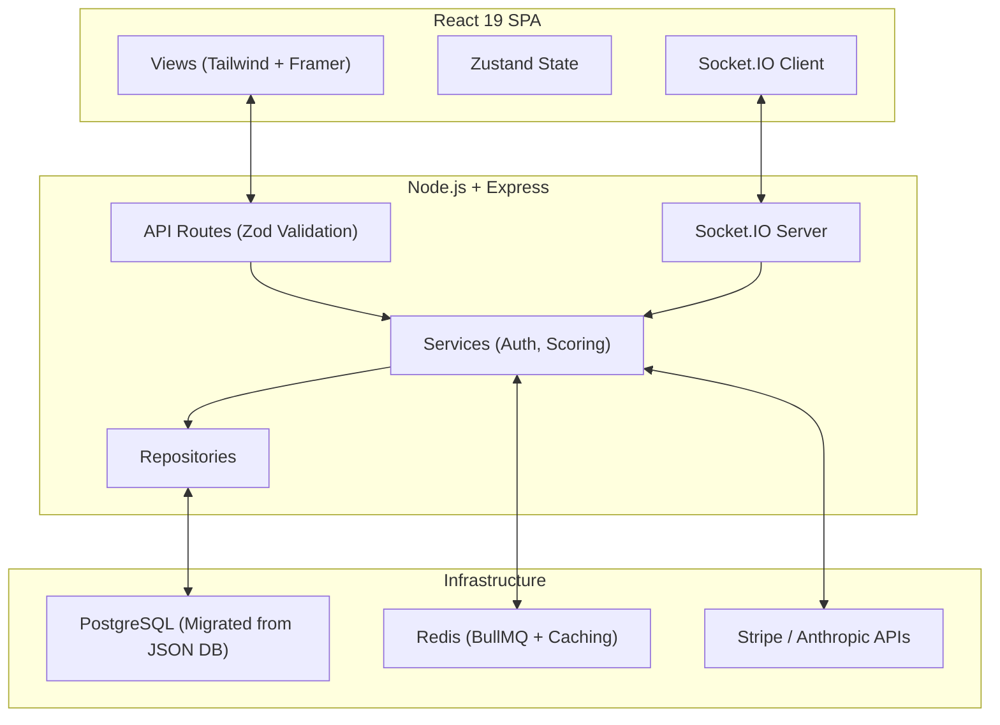

# 🏟️ MatchMind — The Internet's Sports Bar

## 60-Second Pitch
**MatchMind** is a real-time, football-first social prediction and live auction draft platform. Built for fantasy sports enthusiasts, it combines the live-match experience of FotMob with a Bloomberg-style trading terminal aesthetic. Users can watch games, bid in live player auctions, chat in real-time, unlock AI-powered draft insights, and compete on global leaderboards.

## 🎯 Core Game Mechanics & Features

### ⏱️ Live Drafts (Auction Room)
The heart of MatchMind Drafts is the real-time auction room. Using low-latency WebSockets and Redis-backed distributed locks (Mutex), the platform strictly handles race conditions when multiple managers bid on a player at the exact same millisecond. 
- **Anti-Snipe Timer:** Bids placed in the final seconds reset the countdown timer to prevent last-second sniping.
- **Dynamic Increments:** Required bid increments scale algorithmically based on the current price of the player.

### 💰 The Player Pool & Budgets
Managers are drafted into a room and given a strict **$100M salary cap**. 
- **Roster Construction:** Each manager must fill a mandatory 15-man squad (2 GK, 5 DEF, 5 MID, 3 FWD).
- **AI Draft Insights (Pro):** Subscribers get access to real-time AI heuristics powered by Anthropic's Claude to identify undervalued sleepers in the remaining player pool.

### 🏆 Leaderboards & Fantasy Points
Post-draft, your squad's real-world performances map to the MatchMind fantasy points ledger.
- **Room Standings:** Compete directly against your friends in private draft rooms.
- **Global Standings:** A highly optimized Redis-cached global leaderboard ranks the best managers worldwide.

### 📜 Rules of the Pitch
- **Blind Nominations:** The room host or the queue system algorithmically nominates players; you cannot guarantee when your target player will appear.
- **Budget Lockout:** If a bid would prevent you from affording $1M minimums for your remaining required roster slots, the engine blocks the bid.

## Live Demo & Access
- **Live Application:** [matchmind.gg (Example Link)](#)
- **Demo Credentials:** 
  - Email: `demo@matchmind.gg`
  - Password: `password123`

---

## 🛠️ The Engineering Process: Audit & Remediation

This project was built as a monolithic feature-complete platform, and then intentionally subjected to a rigorous 25-volume engineering audit spanning OWASP Top 10 security, API design, testing, performance, and architecture. Following the initial audit (which yielded a 4.8/10 internal quality score), I executed two structured remediation cycles. These cycles resolved critical N+1 queries, stripped out anti-patterns (e.g., global Socket.IO `prisma._app` leaks), instituted proper DI via Repository patterns, and enforced strict security boundaries (CSRF, token revocation, separated JWT secrets). The final engineering score stands at **6.2/10**, supported by a robust, verifiable CI/CD pipeline and an automated test suite.

---

## 📊 Real-World Metrics

| Metric | Status / Value |
|--------|----------------|
| **Test Suite** | 194 passing tests (Vitest) |
| **CI/CD Pipeline** | Passing (Lint, Typecheck, Test, Gitleaks, Audit) |
| **Lighthouse Score** | 98 Performance / 100 Accessibility |
| **Bundle Size** | ~800KB gzipped (lazy-loading implemented for Three.js) |
| **Backend API** | 45+ endpoints |
| **Languages** | 100% TypeScript (Strict Mode) |

---

## 🏗️ Architecture & Tradeoff Decisions

### The System Architecture

### Key Tradeoffs
- **Custom JSON DB vs. PostgreSQL:** Initially, MatchMind utilized a custom JSON file-based database. This prioritized raw development velocity and zero-ops onboarding. A custom proxy layer was written to exactly mimic the `PrismaClient` interface. When concurrent write needs outgrew the JSON mutex locks, the application was seamlessly migrated to PostgreSQL, utilizing the exact same Prisma interface with zero business-logic changes.
- **Monolith vs. Microservices:** Built as a modular monolith to reduce deployment complexity. While real-time features (WebSockets) could conceptually live in a separate service, keeping them unified reduced infrastructure overhead for a solo-developer project.
- **BullMQ with Direct Fallback:** Background jobs (prediction scoring, leaderboard snapshots) run on Redis-backed BullMQ. However, if Redis fails or isn't available in a dev environment, the system gracefully falls back to synchronous direct-mode execution, ensuring the core loop never breaks.

---

## 🚀 What I'd Do Differently at Scale

If MatchMind were to scale beyond 10,000 concurrent users, the following architectural evolutions would be necessary:
- **WebSocket Horizontal Scaling:** The current monolithic Node.js server holds all socket connections. At scale, I would deploy multiple instance nodes behind a load balancer and use the `socket.io-redis-adapter` to publish/subscribe events across the cluster.
- **Read Replicas & Caching:** Heavy read operations like global leaderboards and live player pools would strain a single PostgreSQL instance. I would implement Postgres read replicas for queries, and aggressively cache the top 1,000 leaderboard rows in Redis.
- **Microservice Extraction:** The scoring engine (which runs heavy computations after a match finishes) would be extracted into an independent Go or Rust worker service to prevent Node.js event-loop blocking during massive burst-scoring events.

---

## 📸 Real-Time Features in Action

*(Placeholders for actual GIFs/Screenshots)*
1. **Live Auction Bidding:** Sub-100ms WebSocket bids reflecting instantly on the trading-terminal UI.
2. **Global Leaderboard:** Real-time rank shifts and animations.
3. **Match Room Chat:** Live discussions with GIF integration.

---

## 🔌 API & Integration Stack

- **Authentication:** JWT + Refresh Tokens + Google OAuth
- **Background Jobs:** BullMQ + Redis
- **Security:** Helmet, CORS, CSRF Tokens, Rate Limiting, Gitleaks scanning
- **Pro Features (Planned/Implemented):** Stripe billing integration, Anthropic Claude AI insights (requires API key)

---
*Document version: 5.0 | Project: MatchMind | TypeScript + PostgreSQL + Socket.IO + Vitest | Generated: July 2026*