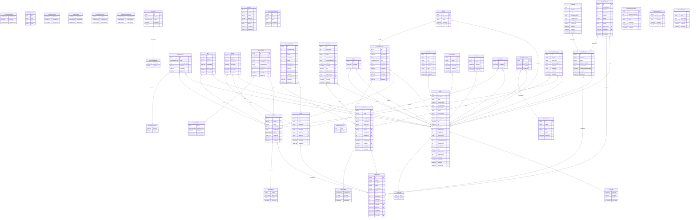

```mermaid
erDiagram

        UserRole {
            USER USER
ADMIN ADMIN
        }
    


        UserTier {
            BRONZE BRONZE
SILVER SILVER
GOLD GOLD
PLATINUM PLATINUM
        }
    


        TournamentStatus {
            UPCOMING UPCOMING
ACTIVE ACTIVE
COMPLETED COMPLETED
        }
    


        PlayerPosition {
            GK GK
DEF DEF
MID MID
FWD FWD
        }
    


        RoomStatus {
            LOBBY LOBBY
DRAFTING DRAFTING
ACTIVE ACTIVE
FINISHED FINISHED
        }
    


        RoomMemberRole {
            member member
admin admin
        }
    


        AuctionPhase {
            IDLE IDLE
NOMINATING NOMINATING
BIDDING BIDDING
RESOLVED RESOLVED
        }
    


        FixtureStatus {
            SCHEDULED SCHEDULED
IN_PLAY IN_PLAY
PAUSED PAUSED
FINISHED FINISHED
        }
    


        PredictionStatus {
            PENDING PENDING
CORRECT CORRECT
INCORRECT INCORRECT
        }
    


        ChatMessageType {
            user user
system system
        }
    


        ReportStatus {
            PENDING PENDING
REVIEWED REVIEWED
RESOLVED RESOLVED
        }
    


        DraftTicketStatus {
            AVAILABLE AVAILABLE
USED USED
        }
    


        DraftSessionStatus {
            ACTIVE ACTIVE
COMPLETED COMPLETED
CANCELLED CANCELLED
        }
    


        DraftRunResultStatus {
            IN_PROGRESS IN_PROGRESS
COMPLETED COMPLETED
ELIMINATED ELIMINATED
        }
    
  "User" {
    String id "🗝️"
    String username 
    String email 
    Boolean emailVerified 
    String passwordHash "❓"
    String displayName "❓"
    String avatar "❓"
    String bannerImage "❓"
    String bio "❓"
    String countryCode "❓"
    UserRole role 
    UserTier tier 
    Int totalPoints 
    Int weeklyPoints 
    Int globalRank "❓"
    Float predAccuracy 
    Int totalPredictions 
    Int correctPredictions 
    Int streakCurrent 
    Int streakBest 
    Boolean isPro 
    DateTime proExpiresAt "❓"
    Int tokenVersion 
    DateTime createdAt 
    DateTime updatedAt 
    DateTime deletedAt "❓"
    DateTime lastActiveAt "❓"
    }
  

  "Tournament" {
    String id "🗝️"
    String name 
    String shortName 
    String status 
    String confederation 
    String gender 
    String format 
    Int teamCount 
    Int squadSize 
    Int launchPhase 
    DateTime startDate "❓"
    DateTime endDate "❓"
    DateTime createdAt 
    DateTime updatedAt 
    DateTime deletedAt "❓"
    }
  

  "Player" {
    String id "🗝️"
    String name 
    String club 
    String nationality 
    String position 
    Float basePrice 
    String photoUrl "❓"
    String rarityTier "❓"
    Boolean isEligibleForIcon 
    DateTime createdAt 
    DateTime updatedAt 
    }
  

  "Room" {
    String id "🗝️"
    String hostId 
    String name 
    String inviteCode 
    Float totalBudget 
    RoomStatus status 
    DateTime createdAt 
    DateTime updatedAt 
    DateTime deletedAt "❓"
    }
  

  "RoomMember" {
    String id "🗝️"
    RoomMemberRole role 
    Float remainingBudget 
    Boolean isReady 
    DateTime createdAt 
    DateTime updatedAt 
    }
  

  "Bid" {
    String id "🗝️"
    String playerId 
    Float amount 
    DateTime timestamp 
    Int version 
    DateTime createdAt 
    DateTime updatedAt 
    }
  

  "Roster" {
    String id "🗝️"
    Float soldPrice 
    DateTime acquiredAt 
    Boolean isCaptain 
    Boolean isViceCaptain 
    DateTime createdAt 
    DateTime updatedAt 
    }
  

  "AuctionState" {
    String id "🗝️"
    AuctionPhase phase 
    String currentPlayerId "❓"
    Float currentBid 
    String currentBidderId "❓"
    DateTime timerEndsAt "❓"
    Int version 
    DateTime createdAt 
    DateTime updatedAt 
    }
  

  "Fixture" {
    String id "🗝️"
    String stage 
    Int round "❓"
    String homeTeamId 
    String awayTeamId 
    String homeTeam 
    String awayTeam 
    String venueId "❓"
    Int homeScore "❓"
    Int awayScore "❓"
    FixtureStatus status 
    DateTime scheduledAt 
    DateTime kickoffAt "❓"
    DateTime createdAt 
    DateTime updatedAt 
    }
  

  "PlayerMatchStat" {
    String id "🗝️"
    Int minutesPlayed 
    Int goals 
    Int assists 
    Boolean cleanSheet 
    Int saves 
    Int penaltiesSaved 
    Int yellowCards 
    Int redCards 
    Int penaltiesMissed 
    Int ownGoals 
    Int goalsConceded 
    DateTime createdAt 
    DateTime updatedAt 
    }
  

  "Prediction" {
    String id "🗝️"
    Int homeGoals 
    Int awayGoals 
    String status 
    Float pointsEarned "❓"
    Json pointsBreakdown "❓"
    DateTime lockedAt "❓"
    DateTime scoredAt "❓"
    Boolean btts "❓"
    String totalGoalsOU "❓"
    Float totalGoalsLine "❓"
    String firstScorerId "❓"
    DateTime createdAt 
    DateTime updatedAt 
    }
  

  "Follow" {
    String id "🗝️"
    DateTime createdAt 
    DateTime updatedAt 
    }
  

  "ChatMessage" {
    String id "🗝️"
    String text 
    DateTime timestamp 
    String gifUrl "❓"
    ChatMessageType type 
    Json reactions "❓"
    Boolean isPinned 
    Boolean isDeleted 
    Boolean isSystem 
    DateTime createdAt 
    DateTime updatedAt 
    DateTime deletedAt "❓"
    }
  

  "Notification" {
    String id "🗝️"
    String type 
    String title 
    String message 
    Boolean isRead 
    Json data "❓"
    DateTime createdAt 
    DateTime updatedAt 
    }
  

  "Report" {
    String id "🗝️"
    String reason 
    String status 
    DateTime createdAt 
    DateTime updatedAt 
    }
  

  "AdminLog" {
    String id "🗝️"
    String adminId 
    String action 
    String targetId "❓"
    String targetType "❓"
    Json detail "❓"
    DateTime createdAt 
    DateTime updatedAt 
    }
  

  "Subscription" {
    String id "🗝️"
    String status 
    String plan 
    DateTime expiresAt "❓"
    DateTime createdAt 
    DateTime updatedAt 
    }
  

  "Session" {
    String id "🗝️"
    String token 
    DateTime expiresAt 
    DateTime createdAt 
    DateTime updatedAt 
    }
  

  "StarredPlayer" {
    String id "🗝️"
    DateTime createdAt 
    DateTime updatedAt 
    }
  

  "LeaderboardSnapshot" {
    String id "🗝️"
    String period 
    Json data 
    DateTime createdAt 
    DateTime updatedAt 
    }
  

  "Achievement" {
    String id "🗝️"
    String name 
    String description 
    String icon 
    Int points 
    DateTime createdAt 
    DateTime updatedAt 
    }
  

  "UserAchievement" {
    String id "🗝️"
    DateTime earnedAt 
    DateTime createdAt 
    DateTime updatedAt 
    }
  

  "DraftSession" {
    String id "🗝️"
    String formation 
    String status 
    String ticketConsumedId 
    Float synergyScore 
    Boolean formationBonusApplied 
    DateTime createdAt 
    DateTime updatedAt 
    }
  

  "DraftPick" {
    String id "🗝️"
    Int slotIndex 
    String position 
    Json offeredPlayerIds 
    Json offeredRarities 
    String pickedPlayerId "❓"
    Boolean autoPicked 
    DateTime pickedAt "❓"
    DateTime createdAt 
    DateTime updatedAt 
    }
  

  "DraftRunResult" {
    String id "🗝️"
    Int currentRound 
    Int totalWins 
    Int totalLosses 
    Int totalTies 
    String status 
    Json rewards 
    Json rounds 
    DateTime eliminatedAt "❓"
    DateTime clearedAt "❓"
    DateTime createdAt 
    DateTime updatedAt 
    }
  

  "DraftTicket" {
    String id "🗝️"
    String userId 
    DraftTicketStatus status 
    DateTime createdAt 
    DateTime updatedAt 
    }
  

  "DraftRewardsCatalog" {
    String id "🗝️"
    Int winCountThreshold 
    String cosmeticId 
    String name 
    String description 
    DateTime createdAt 
    DateTime updatedAt 
    }
  

  "PlayerRarityCache" {
    String id "🗝️"
    String playerId 
    String rarityTier 
    DateTime createdAt 
    DateTime updatedAt 
    }
  

  "RoomTemplate" {
    String id "🗝️"
    String name 
    Json rosterRules 
    Float totalBudget 
    DateTime createdAt 
    DateTime updatedAt 
    }
  

  "FantasyPointsLedger" {
    String id "🗝️"
    String playerId 
    Float basePoints 
    Float captainMultiplier 
    Float totalPoints 
    Json breakdown "❓"
    DateTime createdAt 
    DateTime updatedAt 
    }
  
    "User" |o--|| "UserRole" : "enum:role"
    "User" |o--|| "UserTier" : "enum:tier"
    "Player" }o--|| "Tournament" : "tournament"
    "Room" |o--|| "RoomStatus" : "enum:status"
    "Room" }o--|| "Tournament" : "tournament"
    "RoomMember" |o--|| "RoomMemberRole" : "enum:role"
    "RoomMember" }o--|| "Room" : "room"
    "RoomMember" }o--|| "User" : "user"
    "Bid" }o--|| "Room" : "room"
    "Bid" }o--|| "User" : "user"
    "Roster" }o--|| "Player" : "player"
    "Roster" }o--|| "Room" : "room"
    "Roster" }o--|| "User" : "user"
    "AuctionState" |o--|| "AuctionPhase" : "enum:phase"
    "AuctionState" |o--|| "Room" : "room"
    "Fixture" |o--|| "FixtureStatus" : "enum:status"
    "Fixture" }o--|| "Tournament" : "tournament"
    "PlayerMatchStat" }o--|| "Fixture" : "fixture"
    "PlayerMatchStat" }o--|| "Player" : "player"
    "Prediction" }o--|| "Fixture" : "fixture"
    "Prediction" }o--|| "User" : "user"
    "Follow" }o--|| "User" : "follower"
    "Follow" }o--|| "User" : "following"
    "ChatMessage" |o--|| "ChatMessageType" : "enum:type"
    "ChatMessage" }o--|| "Room" : "room"
    "ChatMessage" }o--|| "User" : "user"
    "Notification" }o--|| "User" : "user"
    "Report" }o--|| "ChatMessage" : "message"
    "Report" }o--|| "User" : "reporter"
    "Subscription" }o--|| "User" : "user"
    "Session" }o--|| "User" : "user"
    "StarredPlayer" }o--|| "Player" : "player"
    "StarredPlayer" }o--|| "User" : "user"
    "UserAchievement" }o--|| "Achievement" : "achievement"
    "UserAchievement" }o--|| "User" : "user"
    "DraftSession" }o--|| "Tournament" : "tournament"
    "DraftSession" }o--|| "User" : "user"
    "DraftPick" }o--|| "DraftSession" : "draftSession"
    "DraftRunResult" |o--|| "DraftSession" : "draftSession"
    "DraftRunResult" }o--|| "Tournament" : "tournament"
    "DraftRunResult" }o--|| "User" : "user"
    "DraftTicket" |o--|| "DraftTicketStatus" : "enum:status"
    "FantasyPointsLedger" }o--|| "Fixture" : "fixture"
    "FantasyPointsLedger" }o--|| "Room" : "room"
    "FantasyPointsLedger" }o--|| "User" : "user"
```
