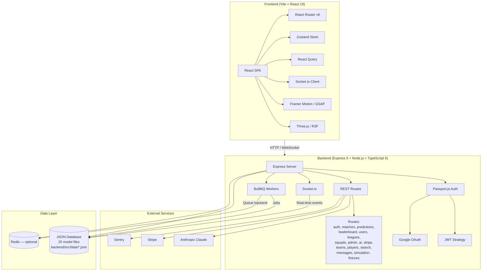
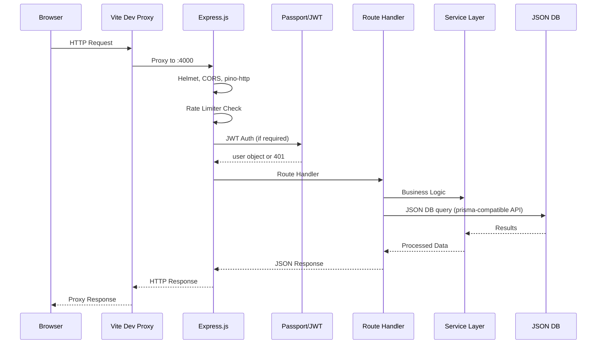
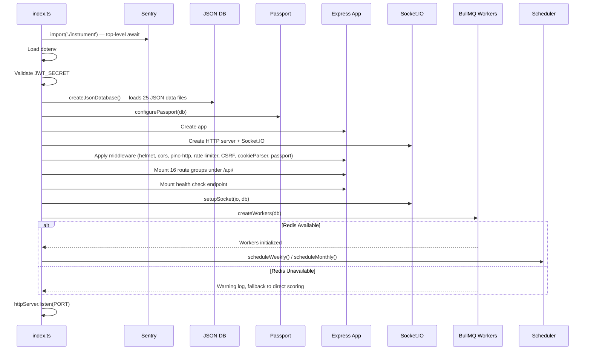
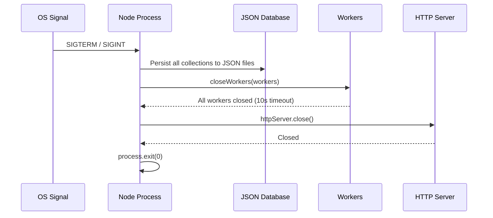
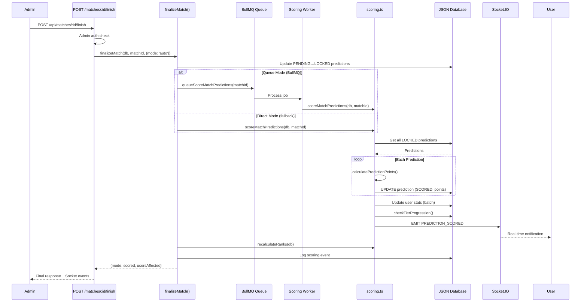

# MatchMind — Architecture

## Current Tech Stack (verified from package.json)

### Backend
| Technology | Version | Purpose |
|------------|---------|---------|
| **Node.js** | 20+ | Runtime |
| **Express.js** | ^5.2.1 | HTTP framework |
| **TypeScript** | ^6.0.3 | Type safety (100% of backend) |
| **JSON Database** | — | Production database (Prisma-compatible API, file-based) |
| **Socket.IO** | ^4.8.3 | Real-time WebSocket events |
| **BullMQ** | ^5.78.0 | Background job queue (scoring, leaderboard resets) |
| **Redis** | 7 | Queue backend, rate limiting (optional — graceful fallback) |
| **Passport.js** | ^0.7.0 | Authentication (JWT + Google OAuth) |
| **bcryptjs** | ^3.0.3 | Password hashing (12 rounds) |
| **jsonwebtoken** | ^9.0.3 | JWT tokens |
| **Stripe** | ^22.2.0 | Subscription payments |
| **Anthropic SDK** | ^0.104.1 | AI prediction hints (Claude) |
| **Zod** | ^4.4.3 | Input validation |
| **Helmet** | ^8.2.0 | Security headers |
| **Pino** | ^10.3.1 | Structured logging |
| **Sentry** | ^10.63.0 | Error monitoring |
| **express-rate-limit** | ^8.5.2 | Rate limiting |
| **Vitest** | ^4.1.9 | Test runner |

### Frontend
| Technology | Version | Purpose |
|------------|---------|---------|
| **React** | ^19.2.6 | UI framework |
| **Vite** | ^8.0.12 | Build tool |
| **TypeScript** | ^6.0.3 | Type safety (100% of frontend) |
| **TanStack React Query** | ^5.101.0 | Server state management |
| **Zustand** | ^5.0.14 | Client state management |
| **React Router** | ^6.30.4 | Client-side routing |
| **Framer Motion** | ^12.40.0 | Animations |
| **GSAP** | ^3.15.0 | Scroll animations |
| **Three.js / R3F** | ^0.184.0 / ^9.6.1 | 3D graphics (landing page) |
| **Tailwind CSS v4** | ^4.3.0 | Utility-first styling |
| **Recharts** | ^3.8.1 | Charts (admin dashboard) |
| **Lucide React** | ^1.17.0 | Icons |
| **Socket.io-client** | ^4.8.3 | WebSocket client |
| **React Hook Form** | ^7.78.0 | Form management |
| **Radix UI** | Various | Accessible primitives |

---

## System Architecture



---

## JSON Database Architecture

The production database is a **file-based JSON database** (`backend/src/lib/jsonDb.ts`) — no PostgreSQL or other database server required. It provides a Prisma-compatible API:

```typescript
// Routes and services call prisma just like Prisma Client:
const users = await prisma.user.findMany({ where: { isPro: true } })
const player = await prisma.player.findUnique({ where: { id } })
const newRoom = await prisma.room.create({ data: { name, ... } })
```

### How It Works

1. **Startup:** All 25 JSON files in `backend/src/data/` are loaded into an in-memory `Record<string, any[]>` store
2. **Queries:** A JavaScript `Proxy` intercepts `prisma.model.method()` calls and routes them to a `ModelHandler` per collection
3. **Writes:** Atomic persistence via temp-file + `fs.renameSync()`, serialized per-collection via `async-mutex`
4. **Relations:** In-memory relation map resolves `include`/`select` (hasMany, belongsTo)
5. **Shutdown:** All collections flushed to disk, timestamped backup created in `.backups/`

### Models (25 files)

| Category | Models |
|----------|--------|
| **Tournaments** | tournaments, teams, players, venues, fixtures, groups, qualification, history |
| **Auction** | rooms, roomMember, auctionState, bids, rosters, fantasyPointsLedger |
| **Social** | follow, notification, chatMessage, report |
| **Commerce** | subscription, session, starredPlayer |
| **Game** | playerMatchStat |
| **Admin** | adminLog, seed |

---

## Request Flow



---

## Startup Sequence



---

## Shutdown Sequence



---

## Data Flow for Scoring



---

## Middleware Stack Order

```
1.  Sentry request handler        (error tracking)
2.  Helmet                        (security headers)
3.  CORS                          (cross-origin requests)
4.  pino-http                     (HTTP request logging)
5.  Global rate limiter           (100/min)
6.  Stripe webhook raw body       (before json parser — signature verification)
7.  express.json()                (body parsing)
8.  cookie-parser                 (cookie parsing)
9.  CSRF protection               (double-submit cookie, skips Bearer + GET + Stripe webhook)
10. Passport initialize           (auth strategies)
11. Route mounting                (16 route groups)
12. Sentry error handler          (error capture)
13. Centralized error handler     (consistent error responses)
```

---

## Route Groups (16 total)

| Group | Endpoints | Auth |
|-------|-----------|------|
| `auth` | signup, login, logout, google OAuth, refresh, forgot/reset password, verify email | Mixed |
| `matches` | list, detail, stats, lineups, H2H, timeline, finish | Admin for finish |
| `predictions` | create, list mine, list by match, score | Required |
| `leaderboard` | global, weekly, sport, friends, history | Mixed |
| `users` | profile, update, follow/unfollow, notifications | Mixed |
| `leagues` | CRUD, join by invite, leaderboard | Mixed |
| `squads` | CRUD, invite members | Required |
| `rooms` | CRUD rooms, join, franchise management | Required |
| `fixtures` | list fixtures, finalize match | Mixed |
| `players` | list, detail | Public |
| `teams` | list, detail | Public |
| `search` | global search (users, teams, players, matches) | Public |
| `ai` | prediction hints, match summaries | Pro-gated |
| `stripe` | checkout, webhook, billing portal, status | Mixed |
| `admin` | stats, users, matches, reports, activity log, settings, draft mode | Admin |
| `messages` | conversations, DM CRUD, mark read | Required |

---

## WebSocket Events (Socket.IO)

### Server → Client
| Event | Payload | Description |
|-------|---------|-------------|
| `SCORE_UPDATE` | `{ matchId, homeScore, awayScore, minute }` | Live score change |
| `GOAL_EVENT` | `{ matchId, team, scorer, minute }` | Goal alert |
| `MATCH_STATUS` | `{ matchId, status }` | Match status change |
| `MATCH_FINISHED` | `{ matchId, homeScore, awayScore }` | Match ended |
| `CHAT_MESSAGE` | `{ roomId, user, text, timestamp }` | New chat message |
| `DM_MESSAGE` | `{ fromUserId, message }` | Direct message |
| `PREDICTION_SCORED` | `{ matchId, pointsEarned, totalPoints, streakCurrent }` | Prediction result |
| `TIER_UPGRADE` | `{ tier, points }` | User tier upgraded |
| `NOTIFICATION` | `{ type, payload }` | In-app notification |
| `AUCTION_STATE` | `{ state }` | Auction state change |
| `BID_PLACED` | `{ bid }` | New bid in auction |
| `VIEWER_COUNT` | `{ count }` | Live viewer count |

### Client → Server
| Event | Payload | Description |
|-------|---------|-------------|
| `JOIN_ROOM` | `{ roomId }` | Join room |
| `LEAVE_ROOM` | `{ roomId }` | Leave room |
| `SEND_MESSAGE` | `{ roomId, text }` | Send message |
| `SEND_REACTION` | `{ roomId, emoji }` | Send reaction |
| `PLACE_BID` | `{ playerId, amount }` | Place auction bid |
| `TYPING` | `{ roomId }` | Typing indicator |
